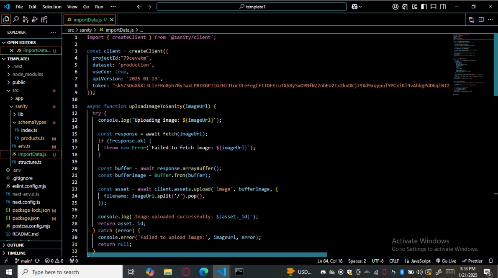
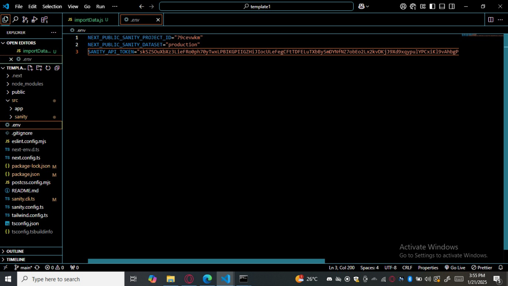
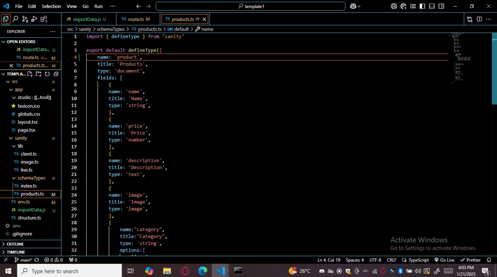
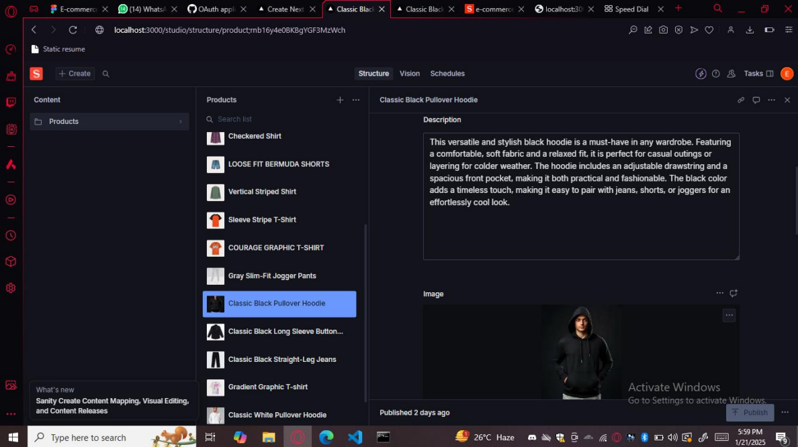
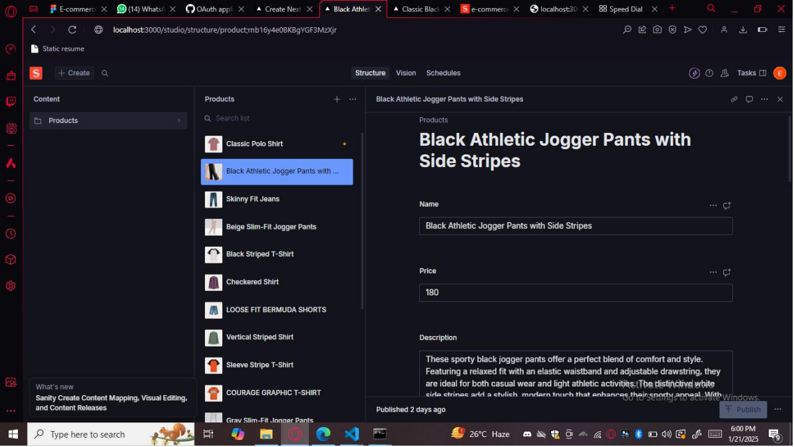

## MARKET PLACE TECHNICALFONDATION - [ GENERAL E-COMMERCEOFDRESSES ] Frontend (Next.Js)

**Documentation of this project is in [_documentation] directory which is in PDF format.**

**Backend (API,Third Party API,Payment Gateway)**

**Requirements:  User Friendly Interface.  Responsive Design For Mobile And Desktop Users.  Essential Pages Include**

1. Homepage
2. Product Detail Page
3. About Us Page
4. Contact Us Page
5. FAQ Page
6. Shopping Cart Page
7. Checkout Page
8. Return/Exchange Policy Page
9. Privacy Policy Page
10. Terms And Condition Page
11. Third party API for shipment tracking,payment gateway and other requiredbackground services.  Sanity CMS To Manage Data For “Sign Up/Login , Product , Order , Shipping, Payment “.

## 1. Sign Up/Login Schema Include:

1. User-Id
2. Email
3. Password
4. Full-Name
5. Phone Number

## 2. Product Schema Include:

1. Id
2. Name
3. Price
4. Stock Quantity
5. Febric
6. Color
7. Image - Url
8. Description

## 3. Order Schema Include:

1. Name
2. User Id
3. Order Date
4. Total Price
5. Quantity
6. Color

## 4. Shipping Schema include:

1. Full name
2. Shipping Adress
3. Shipping Method
4. Shipping Status
5. Postal Code
6. Country

## 5. Payment Schema Include:

1. Payment id
2. Payment method
3. Payment status
4. Payment date

## Business Goal Define:
This website include multiple brands so that you can easily find your selective brand on onewebsite.

## Audience Target:
I Prefer to target clerk or salesperson so that i can run by bussines by wholeselling,But my
target is every person who want to buy cloths.In my website clothes are available for ladiesandgents only. Unique Value Proposition (UVP):
You can get multiple brands from one website so that you can save your money by,On onedelivery you get multiple brands.Otherwise you need to pay separate delivery charges for eachbrand. Sign up/Login

1. Sanity API fetches data for signup/login
2. Confirmation sent to the user, then user comes to dashboard and view products
3. Sanity API fetches data for products Products display on frontend
4. User add items to cart
5. Proceed to checkouts Order details save in User Shipping Form
6. Frontend Shipping data save in sanity
7. Frontend payment Form

**Frontend**
**Sanity**

## Payment details save in sanity

1. Track Order
2. Technology used Next js sanity cms vercel
3. Tailwindcss third party APIS postman
4. Typescript Shipping Tracking GITHUB
5. NEXT.JS SANITY CMSGITHUBTAILWIND CSC 3rd PARTY API VERCELTYPESCRIPT PAYMENTPOSTMANGATWAY

**Screenshot-1**

**Screenshot-2**

**Screenshot-3**

**Screenshot-4**

**Screenshot-5**

